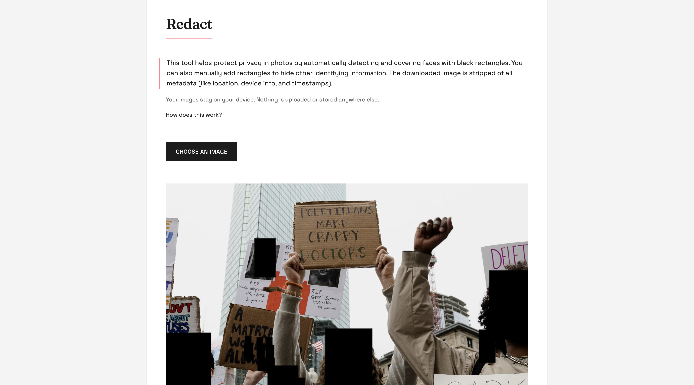

# Redact - Privacy-First Face Detection Tool

## What is Redact?

Redact is a privacy-focused web tool that helps protect people's identities in photos by automatically detecting and covering faces with black rectangles. It's designed for activists, journalists, community organizers, and anyone who needs to protect privacy in visual documentation.

**🌐 Try it now: [redact.miski.studio](https://redact.miski.studio/)**

## Example

*Example: A protest photo with faces automatically detected and redacted, protecting participants' identities while preserving the documentation of the event.*

Beyond face detection, Redact automatically strips all metadata from your images. This includes:
- GPS location data
- Device information (camera model, serial number)
- Date and time the photo was taken
- Software used to edit the photo
- Camera settings and technical details
- Thumbnail previews
- Copyright information
- Comments and descriptions

This metadata removal is crucial for privacy, as photos often contain hidden information that could compromise location, timing, and equipment used during documentation.

### Key Features

- 🔒 **100% Private**: All processing happens in your browser - no images are ever uploaded to any server
- 🤖 **Automatic Face Detection**: Instantly detects faces in photos
- ✏️ **Manual Controls**: Add additional rectangles to cover other identifying information
- 🧹 **Metadata Removal**: Strips out all metadata (location, device info, timestamps) from images
- 💻 **Works Offline**: Can be used without an internet connection after initial load
- 🎯 **Easy to Use**: Simple, intuitive interface for both technical and non-technical users

## For Activists & Organizers

### Why Use Redact?

- **Protect Identities**: Keep participants safe when documenting actions and events
- **No Technical Knowledge Required**: Simple point-and-click interface
- **Complete Privacy**: Your sensitive images never leave your device
- **Quick Processing**: Instantly process photos during time-sensitive situations
- **Additional Protection**: Manually cover badges, signs, or other identifying features

### How to Use

1. Click "Choose an image" to select your photo
2. Wait for automatic face detection
3. Use "Draw Additional Rectangles" to cover other identifying information
4. Click "Download Redacted Image" to save the protected version

## For Developers & Technical Users

### Technical Stack

- Pure JavaScript implementation using Face-API.js
- Face detection powered by SSD MobileNet v1 neural network
- Face landmark detection for improved accuracy
- Canvas-based image manipulation
- No backend dependencies - everything runs client-side

### Key Components

- `face-api.js`: Provides face detection and landmark recognition
- HTML5 Canvas: Handles image manipulation and rectangle drawing
- Client-side image processing: Strips EXIF data during download

### Metadata Removal Process

The tool automatically removes all EXIF, IPTC, and XMP metadata from images during the download process:
- Uses pure JavaScript implementation for metadata removal
- Processes the image through a clean canvas to strip embedded data
- Removes all EXIF tags including GPS, device info, and timestamps
- Strips out IPTC metadata like captions, keywords, and copyright
- Cleans XMP data including editing history and regional info
- Creates a new, clean image file without any historical or identifying information

### Privacy Features

- No server communication after initial page load
- All image processing occurs in-browser
- Automatic cleanup of processed data when tab is closed
- No caching or storage of uploaded images

## Getting Started

1. Clone the repository
2. Open `index.html` in a modern web browser
3. Start using immediately - no build process required

## Browser Compatibility

Works in all modern browsers that support:
- HTML5 Canvas
- JavaScript ES6+
- WebGL (for face detection)

## Contributing

Contributions are welcome! Key areas for improvement:
- Additional privacy features
- Performance optimizations
- Accessibility improvements
- Mobile responsiveness
- Offline-first enhancements

## License

MIT License

Copyright (c) 2024

Permission is hereby granted, free of charge, to any person obtaining a copy
of this software and associated documentation files (the "Software"), to deal
in the Software without restriction, including without limitation the rights
to use, copy, modify, merge, publish, distribute, sublicense, and/or sell
copies of the Software, and to permit persons to whom the Software is
furnished to do so, subject to the following conditions:

The above copyright notice and this permission notice shall be included in all
copies or substantial portions of the Software.

THE SOFTWARE IS PROVIDED "AS IS", WITHOUT WARRANTY OF ANY KIND, EXPRESS OR
IMPLIED, INCLUDING BUT NOT LIMITED TO THE WARRANTIES OF MERCHANTABILITY,
FITNESS FOR A PARTICULAR PURPOSE AND NONINFRINGEMENT. IN NO EVENT SHALL THE
AUTHORS OR COPYRIGHT HOLDERS BE LIABLE FOR ANY CLAIM, DAMAGES OR OTHER
LIABILITY, WHETHER IN AN ACTION OF CONTRACT, TORT OR OTHERWISE, ARISING FROM,
OUT OF OR IN CONNECTION WITH THE SOFTWARE OR THE USE OR OTHER DEALINGS IN THE
SOFTWARE.

## Privacy Policy

This tool is designed with privacy as the primary concern:
- No data collection
- No analytics
- No cookies
- No server communication
- No data storage

## Support

For support, please:

1. Open an issue in the GitHub repository for:
   - Bug reports
   - Feature requests
   - Documentation improvements
   - General questions

2. Submit pull requests for:
   - Bug fixes
   - New features
   - Documentation updates
   - Performance improvements

Please ensure your pull requests:
- Include a clear description of the changes
- Follow the existing code style
- Include tests if applicable
- Update documentation as needed

We aim to review all issues and pull requests within a reasonable timeframe 